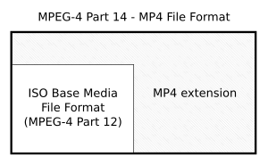
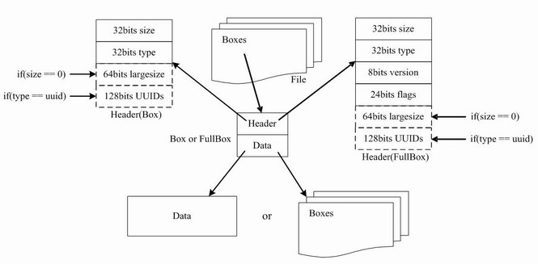

## MP4 (MPEG-4 Part 14)

## 前言
MP4 是 MPEG-4 标准中第14部分，即 [MPEG-4 Part 14](http://www.telemidia.puc-rio.br/~rafaeldiniz/public_files/normas/ISO-14496/ISO_IEC_14496-14_2003_PDF_version_(en).pdf)，是一种常见的音视频容器格式，由国际标准化组织（ISO）和国际电工委员会（IEC）下属的“动态图像专家组”（Moving Picture Experts Group，即MPEG）制定，扩展名常为 `.mp4`。MPEG-4 Part 14 是更通用的 [ISO / IEC 14496-12:2004(Part 14: MP4 file format)](http://www.telemidia.puc-rio.br/~rafaeldiniz/public_files/normas/ISO-14496/ISO_IEC_14496-14_2003_PDF_version_(en).pdf) 的一个实例，他们的关系如下图：



## MP4 文件结构
MP4文件由很多个 `box` 组成，所有的视频信息、视频数据都在这些 `box` 中。`box` 内部分为两部分：`header` 和 `body`，`header` 描述了当前 `box` 的大小（size）和类型（type），而 `body` 里面存放了具体的数据或子 `box` 。
- `box header` 中的 **size** 表示整个盒子的长度（包含header自身、子box长度等），占32位。特殊情况：当size为0时，表示是最后一个 `box` ；当size为1时，表示 `box` 的长度需要更多的bit来描述（64位的largesize表示）。
- `box header` 中的 **type** 表示盒子的类型，占32位，内容即为盒子英文类型的 ASCII 码。特殊情况：当type为uuid时，后续会有个用户自定义盒子类型。

`box` 结构的伪代码：
```c++
aligned(8) class Box (unsigned int(32) boxtype, optional unsigned int(8)[16] extended_type) {
  unsigned int(32) size;
  unsigned int(32) type = boxtype;
  if (size==1) {
    unsigned int(64) largesize;
  } else if (size==0) {
    // box extends to end of file
  }
  if (boxtype==‘uuid’) {
    unsigned int(8)[16] usertype = extended_type;
  }
} 
```

除了上述的 `box` ，还有一种基于它的扩展类 `full box` ，就是在其基础上增加了 8bit version 和 24bit flags，伪代码如下：
```c++
aligned(8) class FullBox(unsigned int(32) boxtype, unsigned int(8) v, bit(24) f)
 extends Box(boxtype) {
 unsigned int(8) version = v;
 bit(24) flags = f;
} 
```

综上，mp4的文件格式如下图所示：



## MP4 盒子类型
|类型10|  |  |  |  |  |重要性|章节|描述|
|--|--|--|--|--|--|--|--|--|
|ftyp||||||*|4.3| file type and compatibility|
|pdin|||||||8.43|progressive download information|
|moov||||||*|8.1| container for all the metadata|
||mvhd|||||*|8.3|movie header, overall declarations|
||trak|||||*|8.4|container for an individual track or stream|
|||tkhd||||*|8.5|track header, overall information about the track|
|||tref|||||8.6|track reference container|
|||edts|||||8.25|edit list container|
||||elst||||8.26|an edit list|
|||mdia||||*|8.7|container for the media information in a track|
||||mdhd|||*|8.8|media header, overall information about the media|
||||hdlr|||*|8.9|handler, declares the media (handler) type|
||||minf|||*|8.10|media information container|
|||||vmhd|||8.11.2|video media header, overall information (video track only)|
|||||smhd|||8.11.3|sound media header, overall information (sound track only)|
|||||hmhd|||8.11.4|hint media header, overall information (hint track only)|
|||||nmhd|||8.11.5|Null media header, overall information (some tracks only)|
|||||dinf||*|8.12|data information box, container|
||||||dref|*|8.13|data reference box, declares source(s) of media data in track|
|||||stbl||*|8.14|sample table box, container for the time/space map|
||||||stsd|*|8.16|sample descriptions (codec types, initialization etc.)|
||||||stts|*|8.15.2|(decoding) time-to-sample|
||||||ctts||8.15.3|(composition) time to sample|
||||||stsc|*|8.18|sample-to-chunk, partial data-offset information|
||||||stsz||8.17.2|sample sizes (framing)|
||||||stz2||8.17.3|compact sample sizes (framing)|
||||||stco|*|8.19|chunk offset, partial data-offset information|
||||||co64||8.19|64-bit chunk offset|
||||||stss||8.20|sync sample table (random access points)|
||||||stsh||8.21|shadow sync sample table|
||||||padb||8.23|sample padding bits|
||||||stdp||8.22|sample degradation priority|
||||||sdtp||8.40.2|independent and disposable samples|
||||||sbgp||8.40.3.2|sample-to-group|
||||||sgpd||8.40.3.3|sample group description|
||||||subs||8.42|sub-sample information|
||mvex||||||8.29|movie extends box|
|||mehd|||||8.30|movie extends header box|
|||trex||||*|8.31|track extends defaults|
||ipmc||||||8.45.4|IPMP Control Box|
|moof|||||||8.32|movie fragment|
||mfhd|||||*|8.33|movie fragment header|
||traf||||||8.34|track fragment|
|||tfhd||||*|8.35|track fragment header|
|||trun|||||8.36|track fragment run|
|||sdtp|||||8.40.2|independent and disposable samples|
|||sbgp|||||8.40.3.2|sample-to-group|
|||subs|||||8.42|sub-sample information|
|mfra|||||||8.37|movie fragment random access|
||tfra||||||8.38|track fragment random access|
||mfro|||||*|8.39|movie fragment random access offset|
|mdat|||||||8.2|media data container|
|free|||||||8.24|free space|
|skip|||||||8.24|free space|

**todo...**

# 参考
- [Part 12: ISO base media file format](https://sce.umkc.edu/faculty-sites/lizhu/teaching/2018.fall.video-com/ref/mp4.pdf)
- [Part 14: MP4 file format](http://www.telemidia.puc-rio.br/~rafaeldiniz/public_files/normas/ISO-14496/ISO_IEC_14496-14_2003_PDF_version_(en).pdf)
- [MP4文件格式入门【blog】](https://www.imooc.com/article/313004)
- [mp4文件格式解析【blog】](https://www.jianshu.com/p/529c3729f357)