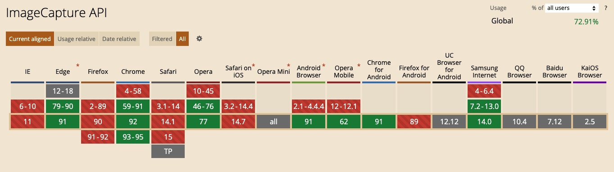

# 视频截图/抓拍

## canvas 截图

借助 canvas 的 `drawImage` 、`toDataURL` 方法对 `<video>` 进行截图。

``` typescript
function captureImage (video: HTMLVideoElement) {
  const { videoWidth, videoHeight } = video;
  const canvas = document.createElememt('canvas');
  canvas.width = videoWidth;
  canvas.height = videoHeight;

  canvas.getContext('2d').drawImage(video, 0, 0, videoWidth, videoHeight);
  
  return canvas.toDataURL('image/jpeg');
}
```

## ImageCapture API 截图
[ImageCapture](https://w3c.github.io/mediacapture-image/) 能够直接从 [MediaStreamTrack（video）](https://developer.mozilla.org/en-US/docs/Web/API/MediaStreamTrack) 中捕获一帧视频帧（图片）。ImageCapture API 的兼容性如下：



可使用 [imagecapture-polyfill](https://github.com/GoogleChromeLabs/imagecapture-polyfill) 进行兼容性处理，原理也是借助 canvas 进行截图。

```typescript
function captureWithImageCapture (track: MediaStreamTrack) {
  if (!window.ImageCapture) {
    return Promise.reject('你的电脑不支持 ImageCapture API');
  }

  const imageCapture = new window.ImageCapture(track);
  return imageCapture.takePhoto().then(URL.createObjectURL);
}
```

*注：`takePhoto()` 第一次调用执行较慢。 [issue](https://github.com/w3c/mediacapture-image/issues/197)*